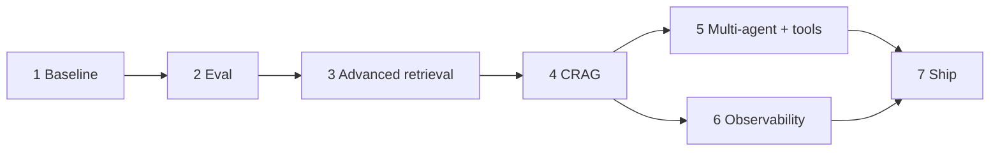

# Implementation Plan
### Enterprise Research & Compliance Assistant

| | |
|---|---|
| **Document owner** | Lead AI Architect |
| **Status** | Draft v1.0 |
| **Last updated** | 2026-05-30 |
| **Implements** | `PRD.md`, `TRD.md` |

---

## How to read this

Seven phases, built in order. Each phase has tasks, a **definition of done**,
and **acceptance criteria** tied to the PRD metrics. The rule that governs the
whole project: **never optimize retrieval without measuring against the eval
baseline.** Phase 2 exists before Phase 3 for exactly this reason.

Effort is in ideal engineering-days for one developer learning the stack;
treat as relative sizing, not commitments.

---

## Current status (as of 2026-05-30)

| Phase | State |
|---|---|
| 1 — Baseline RAG | ✅ Done, runnable |
| 2 — Eval harness | 🟡 Scaffolded; needs real Q/A pairs |
| 3 — Advanced retrieval | ⬜ Not started |
| 4 — LangGraph CRAG | 🟡 Skeleton built & compiles; needs critic + testing |
| 5 — Multi-agent + tools | ⬜ Not started (web_search is a stub) |
| 6 — Observability | ⬜ Config present, commented out |
| 7 — Ship (API/UI/Docker) | ⬜ Not started |

---

## Phase 1 — Baseline RAG ✅
**Goal:** establish a working naive pipeline to beat.

Tasks: loaders + metadata; chunker; Chroma persistence; LCEL answer chain; CLI ingest/ask.
**DoD:** ingest sample corpus, ask a question, get a cited answer.
**Acceptance:** end-to-end run succeeds on `data/sample_docs`.
**Effort:** done.

## Phase 2 — Evaluation harness 🟡 (do this next)
**Goal:** turn quality into numbers; lock the baseline.

Tasks:
- Author ≥ 50 Q/A pairs grounded in the real corpus (cover easy/multi-part/out-of-corpus).
- Wire RAGAS (faithfulness, answer relevancy, context precision/recall).
- Run against the naive baseline; **record scores in the repo**.

**DoD:** `python -m src.eval.ragas_eval` prints baseline metrics.
**Acceptance:** baseline numbers committed; meet PRD baseline targets (faithfulness ≥ 0.65, etc.).
**Effort:** ~2–3 days (most of it is authoring good Q/A pairs).
**Why first:** every later phase is judged against these numbers.

## Phase 3 — Advanced retrieval ⬜
**Goal:** raise context precision/recall measurably.

Tasks (introduce **one at a time, re-run eval after each**):
1. Hybrid search (dense + BM25 + RRF).
2. Parent-document / small-to-big retrieval.
3. Query transformation (HyDE, multi-query, step-back).
4. Cross-encoder reranking.

**DoD:** each strategy behind the common retriever interface; per-strategy eval deltas recorded.
**Acceptance:** context precision ≥ 0.80, recall ≥ 0.85 (PRD §8) with cost/latency noted.
**Effort:** ~4–6 days.
**Depends on:** Phase 2.

## Phase 4 — LangGraph CRAG 🟡
**Goal:** self-correcting agentic loop.

Tasks: skeleton exists (retrieve/grade/transform/web/generate); add a **critic node**
that verifies generated claims against sources and loops back on failure; swap
checkpointer to SQLite; add per-node tracing hooks; unit-test nodes with a mocked LLM.

**DoD:** graph answers, grades, retries on weak context, and refuses when appropriate.
**Acceptance:** faithfulness ≥ 0.90 on eval; hallucination audit < 5%.
**Effort:** ~3–5 days.
**Depends on:** Phase 3 (so the graph retrieves well).

## Phase 5 — Multi-agent + tools ⬜
**Goal:** handle multi-part questions and reach beyond the corpus.

Tasks: planner agent (decompose) + synthesizer; wire `web_search` to Tavily;
add calculator and SQL-over-structured-data tools; convergence/quality loop.

**DoD:** a multi-part compliance question is decomposed, answered across sources, synthesized.
**Acceptance:** US2 satisfied; answer relevancy ≥ 0.85 on multi-part eval slice.
**Effort:** ~5–7 days.
**Depends on:** Phase 4.

## Phase 6 — Observability ⬜
**Goal:** see cost, latency, and trajectory of every run.

Tasks: enable LangSmith tracing; capture latency/cost per query; store eval
datasets in LangSmith; build a small cost/latency dashboard view.

**DoD:** any query is fully traceable; cost per query visible.
**Acceptance:** NFR observability met (TRD §5); cost < $0.02/query confirmed.
**Effort:** ~2 days.
**Depends on:** can run in parallel with Phase 5.

## Phase 7 — Ship (API / UI / Docker) ⬜
**Goal:** make it usable and deployable.

Tasks: FastAPI (`/ingest`, `/ask` streaming, `/health`, `/eval`); Streamlit or
Next.js UI with streaming + visible citations; Dockerfile + volume-mounted Chroma;
basic rate limiting and structured logging.

**DoD:** a user asks via UI and gets a streamed, cited answer; container runs end-to-end.
**Acceptance:** p95 latency targets met (PRD §8); demo-ready.
**Effort:** ~4–6 days.
**Depends on:** Phases 4–6.

---

## Dependency graph

## Definition of done (project)

- All PRD §8 quality targets met on the held-out eval set.
- Benchmark table produced: faithfulness & context precision from naive → agentic, with cost/latency per step. **This artifact is the portfolio deliverable.**
- API + UI + Docker run end-to-end; 50-query manual audit passes (< 5% hallucination).

## Stretch (post-v1)

Evaluation-driven CI (evals on every commit), multi-tenancy with access-control-aware
retrieval, fine-tuned reranker, live document sync, multi-language support.

## Suggested sequencing note

If time is limited, the highest-learning, highest-signal path is
**2 → 3 → 4**: a rigorous eval harness, a measured retrieval-improvement story,
and a self-correcting agent graph. That trio is what demonstrates senior
AI-engineering judgment; 5–7 are productionization on top.
