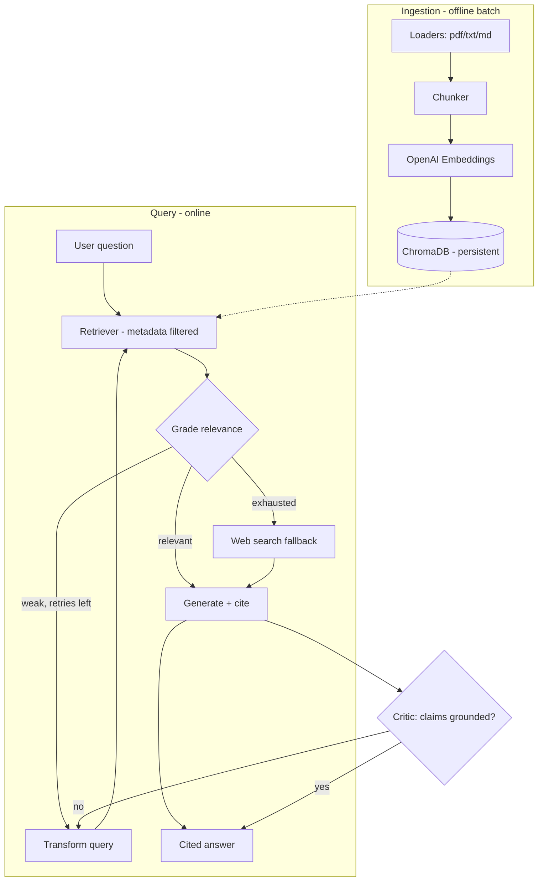

# Technical Requirements Document (TRD)
### Enterprise Research & Compliance Assistant

| | |
|---|---|
| **Document owner** | Lead AI Architect |
| **Status** | Draft v1.0 |
| **Last updated** | 2026-05-30 |
| **Implements** | `PRD.md` |
| **Stack baseline** | LangChain 1.0, LangGraph 1.0 (GA Oct 2025), Python 3.11+ |

---

## 1. Architecture overview

A modular pipeline with a clean split between **ingestion** (offline, batch)
and **query** (online). The query path runs either as a linear LCEL chain
(naive mode) or a stateful LangGraph agent graph (agentic mode).

## 2. Technology stack

| Layer | Choice | Version | Rationale |
|---|---|---|---|
| Language | Python | 3.11+ | Modern typing, broad package support |
| Orchestration (linear) | LangChain (LCEL) | 1.0.x | Loaders, splitters, model interfaces |
| Orchestration (agentic) | LangGraph | 1.0.x | Stateful, cyclic graphs; checkpointing |
| Vector store | ChromaDB via `langchain-chroma` | 0.2.x / 0.5.x | Persistent, metadata filtering, local-first |
| LLM | OpenAI `gpt-4o-mini` (default) | — | Cost/quality balance; configurable |
| Embeddings | OpenAI `text-embedding-3-small` | — | Cheap, strong retrieval |
| Sparse retrieval | `rank-bm25` | 0.2.x | Hybrid search (Phase 3) |
| Evaluation | RAGAS | 0.2.x | Faithfulness / precision / recall |
| Observability | LangSmith | — | Tracing, cost/latency, eval datasets |
| API | FastAPI + Uvicorn | 0.115 / 0.32 | Async, streaming |
| Packaging | Docker | — | Reproducible deploy |

## 3. Data model

### 3.1 Chunk metadata schema (ChromaDB)
| Field | Type | Purpose |
|---|---|---|
| `source` | str | Full path of origin file |
| `filename` | str | Display name for citations |
| `doc_type` | str | `pdf` / `txt` / `md` — filter + parsing hints |
| `department` | str (opt) | Access scoping / filtered retrieval |
| `access_level` | str (opt) | Permission gate at retriever layer |
| `start_index` | int | Char offset for precise citation |

- **Collection:** single named collection (`enterprise_docs`) in v1.
- **Persistence:** local directory (`chroma_db/`); swappable for a server.

### 3.2 Graph state schema (LangGraph)
`RAGState (TypedDict, total=False)`:
`question: str`, `documents: list[Document]`, `relevant: bool`,
`web_fallback_used: bool`, `generation: str`, `retries: int`.

Nodes return *partial* updates; LangGraph merges them into running state.

## 4. Component specifications

### 4.1 Ingestion
- Loaders for pdf/txt/md; enrich metadata; fail loudly on empty corpus.
- `RecursiveCharacterTextSplitter` baseline (chunk 1000 / overlap 150);
  Phase 3 introduces semantic + parent-document strategies behind the same interface.

### 4.2 Vector store / retrieval
- Persistent Chroma wrapper exposing `add_chunks()` and `get_retriever(k, filter)`.
- Retriever supports metadata pre-filtering — **access control is enforced here**, not in the prompt.

### 4.3 Advanced retrieval (Phase 3, pluggable)
Each strategy implements a common retriever interface so it can be A/B'd against the baseline:
1. **Hybrid search** — dense + BM25 sparse, combined via Reciprocal Rank Fusion.
2. **Parent-document / small-to-big** — embed small chunks, return larger parent context.
3. **Query transformation** — HyDE, multi-query expansion, step-back prompting.
4. **Contextual compression / reranking** — cross-encoder reranker over candidates.

### 4.4 Orchestration — LangGraph CRAG
- Nodes: `retrieve`, `grade_documents`, `transform_query`, `web_search`, `generate` (+ `critic` in Phase 5).
- Grader uses **structured output** (Pydantic `with_structured_output`) → typed boolean, not parsed text.
- Conditional edge `decide_after_grade`: relevant → generate; weak & retries left → transform → retrieve; exhausted → web_search.
- Compiled with a **checkpointer** (`InMemorySaver` dev; SQLite/Postgres prod) for resumability and human-in-the-loop interrupts.
- `MAX_RETRIES` bounds the loop to prevent runaway cost/latency.

### 4.5 Evaluation harness
- RAGAS over a curated `EVAL_SET` (≥ 50 Q/A pairs grounded in the corpus).
- Captures `question / answer / contexts / ground_truth` per item.
- Runnable against any answer function (naive or graph) for apples-to-apples comparison.

### 4.6 API (Phase 7)
| Endpoint | Method | Purpose |
|---|---|---|
| `/ingest` | POST | Trigger batch ingestion of a path |
| `/ask` | POST | Query; body `{question, mode, filters}`; supports streaming |
| `/health` | GET | Liveness |
| `/eval` | POST | Run eval suite (admin) |

## 5. Non-functional requirements

| Category | Requirement |
|---|---|
| **Latency** | p95 < 3s naive, < 8s agentic |
| **Cost** | < $0.02/query at default models; track per-query token cost |
| **Scalability** | ≤ ~1M chunks single-node v1; retriever interface allows server-mode Chroma later |
| **Security** | Secrets via env/`.env` (never committed); access control via metadata pre-filter |
| **Reliability** | Bounded retries; graceful "don't know"; no unhandled LLM exceptions surface to user |
| **Observability** | Every query traceable (LangSmith): path taken, docs retrieved, grader verdict, cost |
| **Testability** | Pure node functions; unit-testable; eval gate on quality |

## 6. Evaluation methodology

1. Freeze a versioned eval set in the repo.
2. Record naive baseline scores before any optimization.
3. Introduce one retrieval change at a time; re-run; compare deltas.
4. Track quality **and** cost/latency together — never optimize one blind to the other.
5. Quality targets in `PRD.md §8` are the merge gate.

## 7. Security & access control

- API keys and provider config injected via environment; `.env` gitignored.
- Retrieval-time metadata filtering (`access_level`, `department`) is the
  enforcement point — the LLM never sees documents the user can't access.
- Web-search fallback is opt-in and logged (data may leave the corpus boundary).

## 8. Testing strategy

| Level | Scope |
|---|---|
| Unit | Loader metadata, chunker boundaries, node functions (mock LLM) |
| Integration | Ingest → retrieve → answer on the sample corpus |
| Eval | RAGAS suite as a regression gate |
| Manual audit | 50-query hallucination + "don't know" audit before release |

## 9. Deployment

- Local: venv + `.env` + persistent `chroma_db/`.
- Containerized: Dockerfile bundling API; volume-mount Chroma persistence.
- Config-driven model selection; no code change to swap providers (single line via LangChain interface).

## 10. Open technical questions

- Chunking strategy that maximizes context recall for *contracts* specifically?
- Reranker: hosted (Cohere) vs. local cross-encoder — cost vs. latency tradeoff?
- When does multi-agent decomposition actually beat single-pass CRAG (and at what cost)?
- Checkpointer backend for production: SQLite vs. Postgres at expected concurrency?
